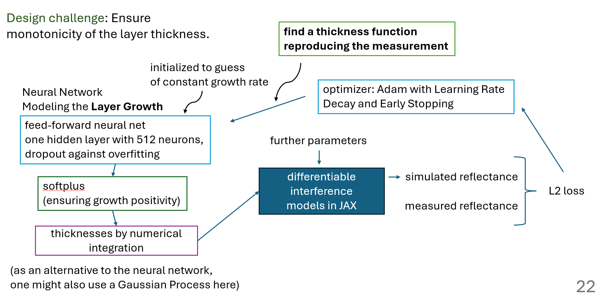
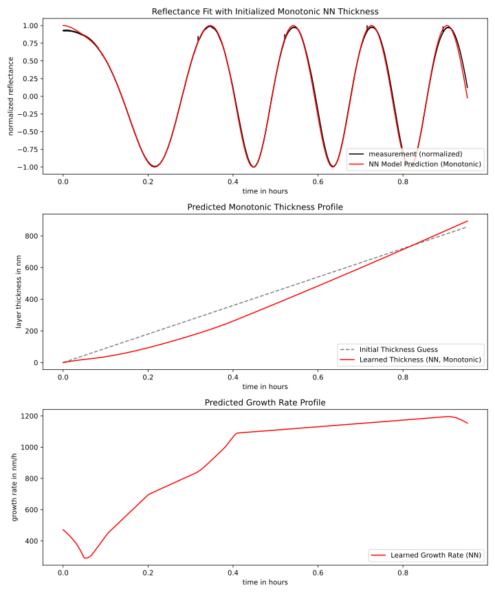
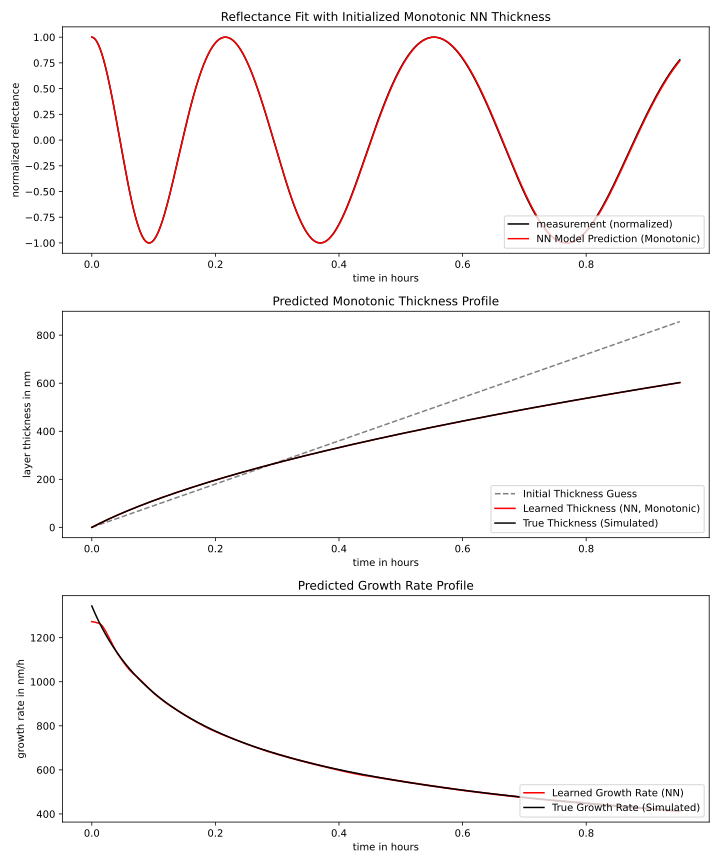

# reflax - Differentiable Interference Modeling for Cost-Effective Growth Estimation of Thin Films

> [!NOTE]  
> This is work in progress. A current presentation can be found under [resources/reflax.pdf](resources/reflax.pdf).

## Challenges in Current Thin Film Growth Measurement Techniques

For measuring the growth behavior of thin films, in our case from Initiated Chemical Vapor Deposition (iCVD), the following methods can e.g. be applied:

- **Spectroscopic Ellipsometry**: This is a non-destructive optical technique that measures the change in polarization as light reflects or transmits from a material structure. It provides information about the thickness and optical properties of thin films. Ellipsometry, however, requires an expensive, complex setup which is challenging to in-situ integrate into a deposition system.
- **Spectroscopic Interferometry**: Using a model for the reflectance of the film over a range of wavelengths, the film thickness is determined, as in [González-Ramírez et al. (2009)](https://doi.org/10.1155/2009/594175). For this however, one needs to know the refractive index of the film as a function of wavelength, requiring additional measurements and errors in the refractive index will propagate into the thickness measurement. Also one still needs a spectral measurement setup.

with other techniques not discussed here being Rutherford backscattering spectroscopy and GIXRD/XRR techniques.

To wrap up, current techniques are either costly, complex or need additional information on the material properties.

## Machine Learning for Thin Film Growth Estimation Using Only Single-Wavelength Reflectance Measurements

Measuring the reflectance for a single wavelength of a thin film as it grows over time produces a time series, a periodic signal with non-sinusoidal form as given by the different optical models implemented in reflax and a phase that is a linear function of the film thickness. But how can the thickness as a function of time be retrieved from the reflectance signal over time?

We achieve this by using a

- different differentiable forward models to get from thickness to reflectance
- a neural network representing the thickness function
- training procedures to optimize for a thickness function reproducing measurements

i.e. *we can get the thickness as a function of time only from the reflectance signal of a single wavelength and the corresponding refractive index of the film at that wavelength*. To measure this, only a very simple inexpensive setup is required.

This is implemented in [analysis/estimate_growth.py](analysis/estimate_growth.py).

Below, the measurement setup is illustrated.

|  |
|:----------------------------:|
| Model Overview               |

Below, experimental and validation results are shown.

|  |
|:---------------------------------------------------:|
| Analysis of a Real-World Measurement                |

|  |
|:----------------------------------------------------------:|
| Validation on a Given Thickness Profile                    |

## Idea for Training Speedup - Speeding Up Learning Neural Network Terms in Differentiable Simulators using Operator Learning / Refining Operator Learning Results using Differentiable Simulators

As the L2 loss on the periodic reflectance profile is complex (and so is e.g. a SoftDTW loss), we already start training from a neural network initialized to represent linear growth. An improvement over this could be to train a neural operator to get from reflectance time series to the thickness time series. One could use this result to pre-train the neural network representing the thickness time series to significantly speed up the optimization to the measured reflectance time series through the differentiable forward model.

## Measuring the Refractive Index and Thickness over Time in one Go

With a measurement setup for spectral reflectance as in [González-Ramírez et al. (2009)](https://doi.org/10.1155/2009/594175) for a growing thin film, we measure reflectance over wavelength and time. With the additional spectral information, we can in addition to our neural network for the thickness e.g. fit a Cauchy model to the refractive index over wavelength, alleviating the core limitation of the [González-Ramírez et al. (2009)](https://doi.org/10.1155/2009/594175) method of needing the refractive index as a function of wavelength in case of in-situ measurements for growing thin films.

## Roadmap Till NeurIPS 2025

- [ ] further validation on synthetic data, hyperparameter tuning
- [ ] trying the operator learning approach for training speedup
- [ ] testing and validation on spectral data, demonstrate that a Cauchy model and growth function can be learned simultaneously
- [ ] cleanup and refactoring of the codebase
- [ ] documentation
