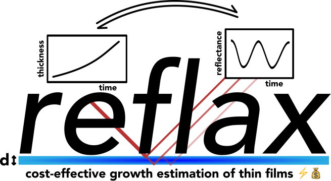
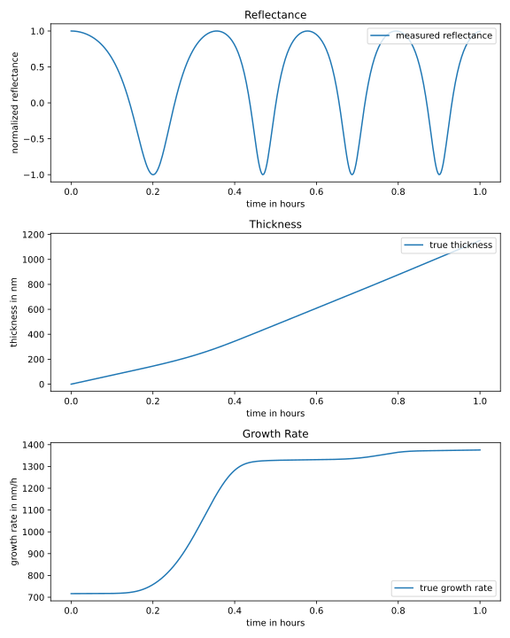
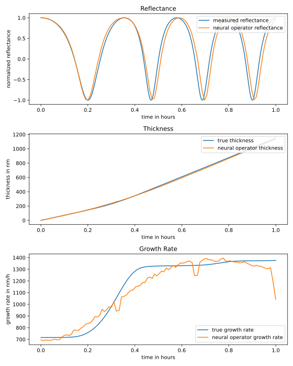
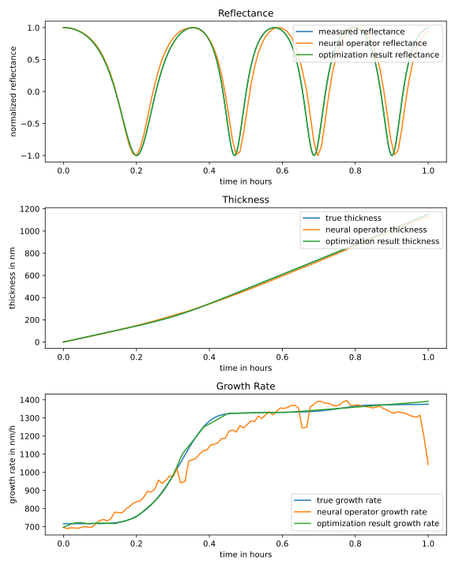

# reflax - Differentiable Interference Modeling for Cost-Effective Growth Estimation of Thin Films


 
> The results from the paper can be reproduced using the scripts in the `paper` folder.

`reflax` is an open-source `JAX` library for inferring thin film growth behavior, featuring differentiable interference forward models

- a single layer ray propagation model
- a general transfer matrix model

to go from thin layer thickness and other setup parameters to reflectance as well as

- a predefined neural network architecture outputting a monotonic thickness function (thickness model)
- an optimization loop to optimize the parameters of the thickness model to minimize the discrepency between the simulator output and a mea

and

- function sampling tools to generate example thickness functions (based on Gaussian process samples) with user specified bounds on the final thickness as well as the minimum and maximum growth rates

which can be used to generate training data for

- a neural operator model estimating the a thickness time series from a reflectance time series

which may be used as an initialization in the optimization of the thickness model through the differentiable interference forward model.


## Installation

Until the public release, you may download the repository and install it locally with

```bash
pip install .
```

## Usage Guide

> The following guide is also available interactively as a Jupyter notebook under [`notebooks/overview.ipynb`](notebooks/overview.ipynb).

### Necessary imports for the examples

```python 
# ==== GPU selection ====
import os
os.environ["CUDA_VISIBLE_DEVICES"] = "1"
# =======================

# NOTE: without 64-bit precision,
# the Cholesky decomposition used
# in sampling thickness profiles
# will fail, apart from that single
# precision is sufficient
from jax import config
config.update("jax_enable_x64", True)

import jax
import jax.numpy as jnp
from flax import nnx

import matplotlib.pyplot as plt

# simulator setup
from reflax._reflectance_models._one_layer_model import get_polarization_components
from reflax.parameter_classes.parameters import (
    ForwardModelParams,
    LayerParams,
    SetupParams,
    LightSourceParams,
    TransmissionMediumParams,
    IncidentMediumParams
)

# constants
from reflax import (
    ONE_LAYER_MODEL,
    TRANSFER_MATRIX_METHOD,
    S_POLARIZED,
    NO_NORMALIZATION,
    MIN_MAX_NORMALIZATION
)

# thickness sampling
from reflax.thickness_modeling.function_sampling import (
    sample_derivative_bound_gp,
    sample_linear_functions
)

# forward modeling
from reflax.forward_model.forward_model import forward_model
from reflax.forward_model.forward_model import batched_forward_model

# neural operator initialization
from reflax.thickness_modeling.operator_learning import (
    NeuralOperatorMLP,
    save_model,
    load_model,
    train_neural_operator
)

# optimization through the differentiable simulator
from reflax.thickness_modeling.nn_modeling import (
    RawGrowthNN,
    predict_growth_rate,
    predict_thickness,
    pretrained_initialization,
    train_nn_model
)
```

### Forward modeling: thickness time series → reflectance time series

#### Setting up the forward model

```python
model = ONE_LAYER_MODEL # alternatively: TRANSFER_MATRIX_METHOD

# here we will normalize the reflectance
# to lie between -1 and 1
normalization = MIN_MAX_NORMALIZATION

# wavelength of the light source in nm
wavelength = 632.8

# angle of incidence to the surface normal
polar_angle = jnp.deg2rad(75)
azimuthal_angle = jnp.deg2rad(0)

# setup parameters
setup_params = SetupParams(
    polar_angle = polar_angle,
    azimuthal_angle = azimuthal_angle,
)

# polarization state of the light source
polarization_state = S_POLARIZED
s_component, p_component = get_polarization_components(polarization_state)

# setting up the light source parameters
light_source_params = LightSourceParams(
    wavelength = wavelength,
    s_component = s_component,
    p_component = p_component
)

# optical parameters of the incident medium
# typically air
permeability_reflection = 1.0
permittivity_reflection = 1.0
incident_medium_params = IncidentMediumParams(
    permeability_reflection = permeability_reflection,
    permittivity_reflection = permittivity_reflection
)

# optical parameters of the transmission medium
# a.k.a. the substrate on which 
# the thin film is deposited
permeability_transmission = 1.0
permittivity_transmission = (3.8827 + 0.019626j)**2
transmission_medium_params = TransmissionMediumParams(
    permeability_transmission = permeability_transmission,
    permittivity_transmission = permittivity_transmission
)

backside_mode = 1

# possibly static layers below the growing thin film
static_layer_params = LayerParams(
    thicknesses = jnp.array([0.0]),
    permeabilities = jnp.array([1.0]),
    permittivities = jnp.array([1.457**2]),
)

# optical parameters of the growing thin film
n_variable = 1.457
k_variable = 0.0
permeability_variable_layer = 1.0
permittivity_variable_layer = (n_variable + 1j * k_variable)**2
variable_layer_params = LayerParams(
    permeabilities = permeability_variable_layer,
    permittivities = permittivity_variable_layer,
)

# setting up the forward model parameters
forward_model_params = ForwardModelParams(
    model = model,
    setup_params = setup_params,
    light_source_params = light_source_params,
    incident_medium_params = incident_medium_params,
    transmission_medium_params = transmission_medium_params,
    static_layer_params = static_layer_params,
    variable_layer_params = variable_layer_params,
    backside_mode = backside_mode,
    polarization_state = polarization_state,
    normalization = normalization,
)
```

#### Generating an examplary thickness time series

We use the sampling tools for smooth non-decreasing functions also implemented in `reflax`.

```python
# as an example we take 400 time points
# between 0 and one hour
time_points_measured = jnp.linspace(0, 1, 400)

# specify the random key
random_key = jax.random.PRNGKey(89)

# here we only want to sample one
# thickness profile
num_samples = 1

# parameters of the RBF kernel of the
# underlying Gaussian process
lengthscale = 0.1
variance = 10.0

# minimum and maximum growth 
# rate in nm/h (per hour
# as of the definition of
# time_points)
min_slope = 200.0
max_slope = 1800.0

# minimum and maximum final thickness
min_final_thickness = 800.0
max_final_thickness = 1200.0

# draw the sample
true_thickness, true_growth_rate = sample_derivative_bound_gp(
    random_key,
    num_samples,
    time_points_measured,
    lengthscale,
    variance,
    min_slope,
    max_slope,
    random_final_values = True,
    min_final_value = min_final_thickness,
    max_final_value = max_final_thickness,
    convex_samples = True,
)

# squeeze the output, as it is generate with
# shape num_samples x num_time_steps
true_thickness = jnp.squeeze(true_thickness)
true_growth_rate = jnp.squeeze(true_growth_rate)
```

#### Running the forward model
If we want to model static sublayers, we must use the `TRANSFER_MATRIX_METHOD`, if we only want to model the growing thin film, we can use either the `TRANSFER_MATRIX_METHOD` or the `ONE_LAYER_MODEL` for the model variable.

```python
measured_reflectance = forward_model(
    model = model,
    setup_params = setup_params,
    light_source_params = light_source_params,
    incident_medium_params = incident_medium_params,
    transmission_medium_params = transmission_medium_params,
    static_layer_params = static_layer_params,
    variable_layer_params = variable_layer_params,
    variable_layer_thicknesses = true_thickness,
    backside_mode = backside_mode,
    polarization_state = polarization_state,
    normalization = normalization
)
```



### Inverse modeling: reflectance time series → thickness time series

In the following, we will show how you can from a single wavelength reflectance time series of a growing thin film infer the thickness time series.

> Note that here we consider inference under a given experimental setup with known refractive index of the thin layer. While the refractive index could also be inferred, we have not yet adapted our pipeline accordingly.

#### Training a neural operator for inferring the thickness time series

> Note that the aforementioned neural operator initialization requires a known given total duration of the growth process and fixed experimental setup - but the neural operator can be trained very quickly (sub 30 seconds on an NVIDIA A100) so this is not much of a limitation.

##### Generating the training data

We first generate the training data. The training data is sampled at fixed time points, here $100$ equally spaced points between $0$ and $1$ hour. Measurements will typically have a higher temporal resolution, so we will need to downsample.

```python
# path where the training data will be saved
training_data_path = "training_data.npz"

# equally spaced time points
num_eval_points_neural_operator = 100
time_points_neural_operator = jnp.linspace(0, 1, num_eval_points_neural_operator)

# simple linear thickness profiles
num_samples_linear = 100

# smooth thickness profiles, sampled
# based on a Gaussian process
num_samples_gp = 2000

# minimum and maximum final thickness
# for both linear and GP samples
# (in nm)
max_final_thickness = 1200.0
min_final_thickness = 800.0

# random keys for sampling
random_key_linear = jax.random.PRNGKey(123)
random_key_gp = jax.random.PRNGKey(89)

# sample linear functions
thicknesses_linear, derivatives_linear = sample_linear_functions(
    random_key_linear,
    num_samples_linear,
    time_points_neural_operator,
    min_final_thickness,
    max_final_thickness,
)

# parameters of the RBF kernel of the
# underlying Gaussian process
lengthscale_gp = 0.4
variance = 15.0

# minimum and maximum growth rate
# in nm/h (per hour), held via
# rejection sampling
min_slope = 200.0
max_slope = 1800.0

# draw the gp samples
thickness_gp, derivatives_gp = sample_derivative_bound_gp(
    random_key_gp,
    num_samples_gp,
    time_points_neural_operator,
    lengthscale_gp,
    variance,
    min_slope,
    max_slope,
    random_final_values = True,
    min_final_value = min_final_thickness,
    max_final_value = max_final_thickness,
    convex_samples = True, # we limit ourselves to convex thickness profiles
)

# concatenate all thicknesses (linear and GP) and derivatives
thicknesses_training_neural_operator = jnp.concatenate((thicknesses_linear, thickness_gp), axis=0)
derivatives_training_neural_operator = jnp.concatenate((derivatives_linear, derivatives_gp), axis=0)

# generate reflectance data
reflectances = batched_forward_model(
    model = model,
    setup_params = setup_params,
    light_source_params = light_source_params,
    incident_medium_params = incident_medium_params,
    transmission_medium_params = transmission_medium_params,
    static_layer_params = static_layer_params,
    variable_layer_params = variable_layer_params,
    variable_layer_thicknesses = thicknesses_training_neural_operator,
    backside_mode = backside_mode,
    polarization_state = polarization_state,
    normalization = normalization,
    computation_batch_size = 100
)

# save the training data
jnp.savez(
    training_data_path,
    thicknesses = thicknesses_training_neural_operator,
    derivatives = derivatives_training_neural_operator,
    reflectances = reflectances,
    time_points = time_points_neural_operator,
)
```

##### Training the neural operator

With this training data, we can train the neural operator.

```python
neural_operator_path = "neural_operator.pickle"

# load the training data
training_data = jnp.load(training_data_path)
reflectances_training_neural_operator = training_data["reflectances"]
thicknesses_training_neural_operator = training_data["thicknesses"]
derivatives_training_neural_operator = training_data["derivatives"]
time_points_training_neural_operator = training_data["time_points"]

neural_operator = NeuralOperatorMLP(
    hidden_dims = [512, 512],
    num_eval_points = time_points_neural_operator.shape[0],
    rngs = nnx.Rngs(42),
)

neural_operator = train_neural_operator(
    model = neural_operator,
    reflectance_data = reflectances_training_neural_operator,
    thickness_data = thicknesses_training_neural_operator,
    learning_rate = 1e-4,
    test_set_size = 0.2,
    num_epochs = 20000,
    print_interval = 500,
    patience = 4000,
    random_seed_split = 42 
)

save_model(
    neural_operator,
    filepath = neural_operator_path,
)
```

##### Testing the neural operator
Let us test the neural operator on the example thickness time series generated above (which has a shorter lengh scale in the RBF Kernel compared to the training data).

```python
# load the neural operator model
neural_operator = load_model(
    filepath = neural_operator_path,
    abstract_model = neural_operator,
)
# downsample the time points to the number of points in the neural operator
indices = jnp.linspace(0, time_points_measured.shape[0] - 1, num_eval_points_neural_operator).astype(int)
downsampled_time_points = time_points_measured[indices]
measured_reflectance_downsampled = measured_reflectance[indices]
thickness_neural_operator = neural_operator(measured_reflectance_downsampled)
growth_rate_neural_operator = jnp.gradient(thickness_neural_operator, downsampled_time_points)
optimization_result_reflectance_neural_operator = forward_model(
    model = model,
    setup_params = setup_params,
    light_source_params = light_source_params,
    incident_medium_params = incident_medium_params,
    transmission_medium_params = transmission_medium_params,
    static_layer_params = static_layer_params,
    variable_layer_params = variable_layer_params,
    variable_layer_thicknesses = thickness_neural_operator,
    backside_mode = backside_mode,
    polarization_state = polarization_state,
    normalization = normalization
)
```



#### Inferring the thickness time series by optimization through the differentiable simulator

We will use the differentiability of our simulator to infer the thickness profile represented by a neural network (more exactly, the neural network represents a raw growth rate which is made positive (softplus) and numerically integrated to yield a monotonically increasing thickness profile). We will use *neural operator initialized optimization* here, i.e. we warm start the optimization to the neural operator result obtained above.

```python
learning_rate = 4e-4
num_epochs = 25000
print_interval = 500
patience = 8000
seed_for_random_initialization = 0
pretrain_learning_rate = 4e-4
pretrain_num_epochs = 20000

growth_nn = RawGrowthNN(dmid = 1024, rngs = nnx.Rngs(42))

neural_operator = load_model(
    filepath = neural_operator_path,
    abstract_model = neural_operator,
)

growth_nn = pretrained_initialization(
    growth_nn,
    thickness_neural_operator,
    downsampled_time_points,
    pretrain_num_epochs,
    pretrain_learning_rate,
)

# train the neural network on the generated data
growth_nn, reflectance_losses = train_nn_model(
    growth_nn,
    forward_model_params,
    time_points_measured,
    measured_reflectance,
    learning_rate = learning_rate,
    num_epochs = num_epochs,
    print_interval = print_interval,
    patience = patience
)

# predict the thickness and derivative
optimization_result_thickness = predict_thickness(
    growth_nn,
    time_points_measured
)

optimization_result_growth_rate = predict_growth_rate(
    growth_nn,
    time_points_measured
)

# calculate the reflectance from the optimization_result thickness
optimization_result_reflectance = forward_model(
    model = model,
    setup_params = setup_params,
    light_source_params = light_source_params,
    incident_medium_params = incident_medium_params,
    transmission_medium_params = transmission_medium_params,
    static_layer_params = static_layer_params,
    variable_layer_params = variable_layer_params,
    variable_layer_thicknesses = optimization_result_thickness,
    backside_mode = backside_mode,
    polarization_state = polarization_state,
    normalization = normalization
)
```
